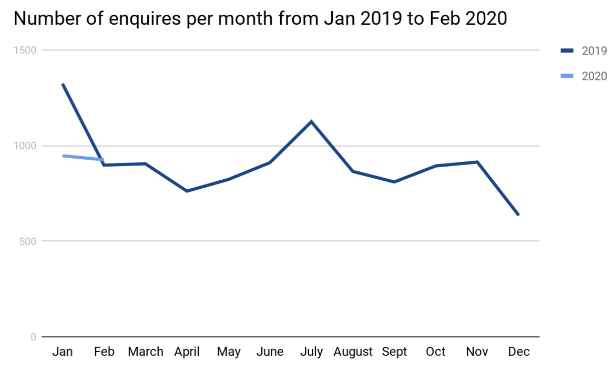
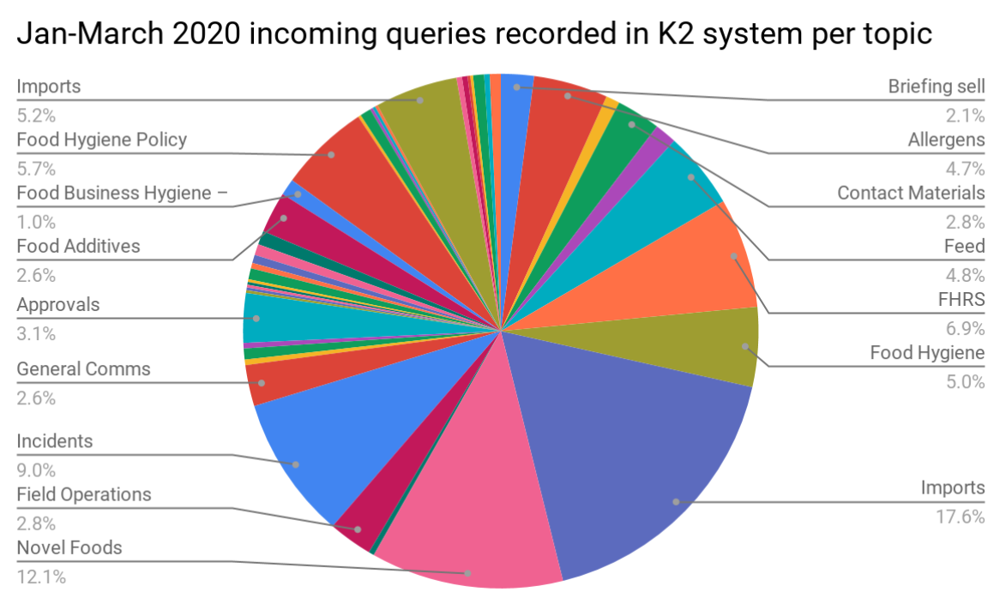
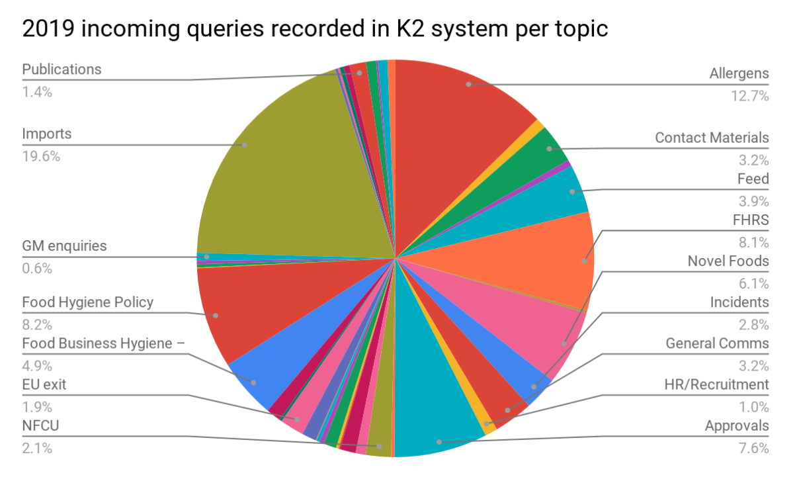

Data gathered through the queries

Contact information
- title, initial, first name, surname, company name
- telephone number
- email address
- address
- post code
 
Enquiry information
- enquiry type
- enquiry reason
- enquiry description
- team enquiry is assigned to
- enquiry response 
- Enquiry status
 
Operational/Analytical information
- service level adherence (i.e. responded to within / outside 20 days)
- telephony data (total calls received, calls answered, % of calls answered & abandoned, % of calls answered within xx seconds...)
- email data (total emails received, by whom - which department which agent, how long it takes to solve a query, % of redirected enquiries to different departments...)
- total enquiries received yesterday / last week / last month / last year
- total open enquiries
- total in progress enquiries
- enquiries handled by user
- total volume of escalations
- FCR (first contact resolution) rate 
- Type of queries in a more granular approach

Through this discovery it has been shared the Performance in Correspondence with public 

"The FSA does not centrally record all incoming and outgoing correspondence and contact with members of the public. Contact details for FSA business areas are available on the FSA website for members of the public and food businesses to contact directly. During 2018, the FSA’s general enquiries helpline handled 2,592 emails and 10,234 phone calls from members of the public. Additionally, FSA Private Office officials managed 252 items of correspondence, including items sent by members of the public to Ministers, the FSA Chair, FSA Chief Executive or other, replying to 86.7% within target."

Data analyses will become crucial for agile scaling the helpline team in proactively informed peak moments.

Some of the archived Parliamentary Questions could be found on https://www.parliament.uk/business/publications/business-papers/commons/parliamentary-questions/.

Data graph

[Uploaded file](uploads/K2_HelpLineData_20200401_2.xlsx)

Data assets
**Number of requests each month:**
Year   Month No

2020   3        282

2020   2        926

2020   1        947

2019   12       635

2019   11       914

2019   10       894

2019   9        810

2019   8        865

2019   7        1125

2019   6        911

2019   5        823

2019   4        762

2019   3        905

2019   2        898

2019   1        1324

**Number of requests per topic:**

Year   Month Status No

2020   3        Environmental Health         79

2020   3        FSA    60

2020   3        Help Line      106

2020   3        N/A     4

2020   3        OGD  20

2020   3        Trading Standards   13

2020   2        Environmental Health         219

2020   2        FSA    218

2020   2        Help Line      419

2020   2        N/A     9

2020   2        OGD  43

2020   2        Trading Standards   18

2020   1        Environmental Health         263

2020   1        FSA    197

2020   1        Help Line      407

2020   1        N/A     22

2020   1        OGD  39

2020   1        Trading Standards   19

2019   12       Environmental Health         202

2019   12       FSA    135

2019   12       Help Line      261

2019   12       N/A     4

2019   12       OGD  10

2019   12       Trading Standards   23

2019   11       Environmental Health         359

2019   11       FSA    159

2019   11       Help Line      351

2019   11       N/A     5

2019   11       OGD  26

2019   11       Trading Standards   14

2019   10       Environmental Health         330

2019   10       FSA    166

2019   10       Help Line      353

2019   10       N/A     5

2019   10       OGD  17

2019   10       Trading Standards   23

2019   9        Environmental Health         305

2019   9        FSA    109

2019   9        Help Line      320

2019   9        N/A     47

2019   9        OGD  15

2019   9        Trading Standards   14

2019   8        Environmental Health         274

2019   8        FSA    139

2019   8        Help Line      346

2019   8        N/A     82

2019   8        OGD  14

2019   8        Trading Standards   10

2019   7        Environmental Health         389

2019   7        FSA    177

2019   7        Help Line      399

2019   7        N/A     132

2019   7        OGD  19

2019   7        Trading Standards   9

2019   6        Environmental Health         287

2019   6        FSA    191

2019   6        Help Line      305

2019   6        N/A     99

2019   6        OGD  21

2019   6        Trading Standards   8

2019   5        Environmental Health         240

2019   5        FSA    192

2019   5        Help Line      287

2019   5        N/A     59

2019   5        OGD  26

2019   5        Trading Standards   19

2019   4        Environmental Health         225

2019   4        FSA    169

2019   4        Help Line      282

2019   4        N/A     41

2019   4        OGD  26

2019   4        Trading Standards   19

2019   3        Environmental Health         289

2019   3        FSA    209

2019   3        Help Line      321

2019   3        N/A     26

2019   3        OGD  32

2019   3        Trading Standards   28

2019   2        Environmental Health         291

2019   2        FSA    224

2019   2        Help Line      302

2019   2        N/A     18

2019   2        OGD  31

2019   2        Trading Standards   32

2019   1        Environmental Health         432

2019   1        FSA    429

2019   1        Help Line      329

2019   1        N/A     21

2019   1        OGD  53

2019   1        Trading Standards   60