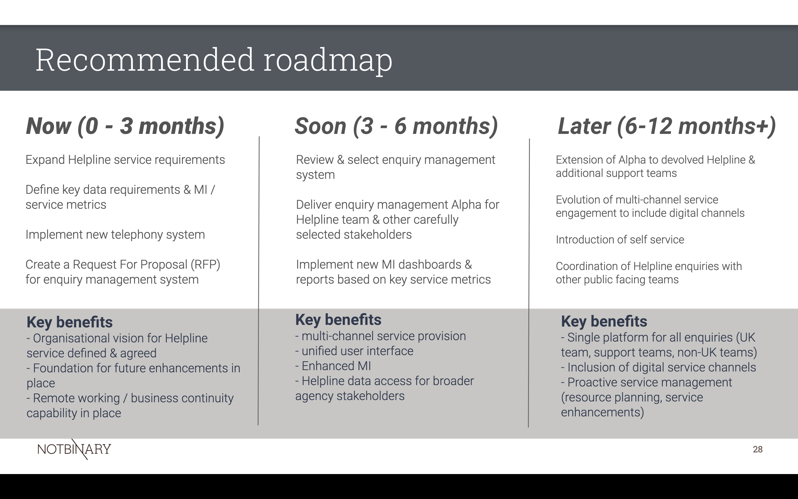

In the immediate term (0-3 months) we recommend taking the following actions before moving to alpha;

- conduct user research with external users (i.e. consumers of the Helpline service)

More information on both immediate next steps, longer term initiatives as well as key benefits for the agency can be viewed in the proposed roadmap here;  