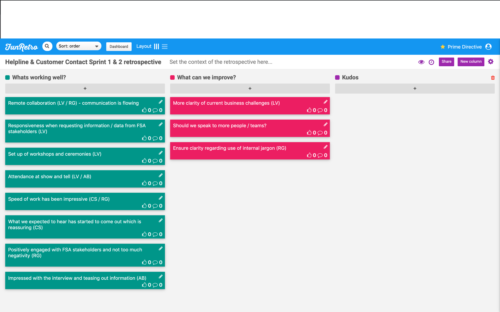
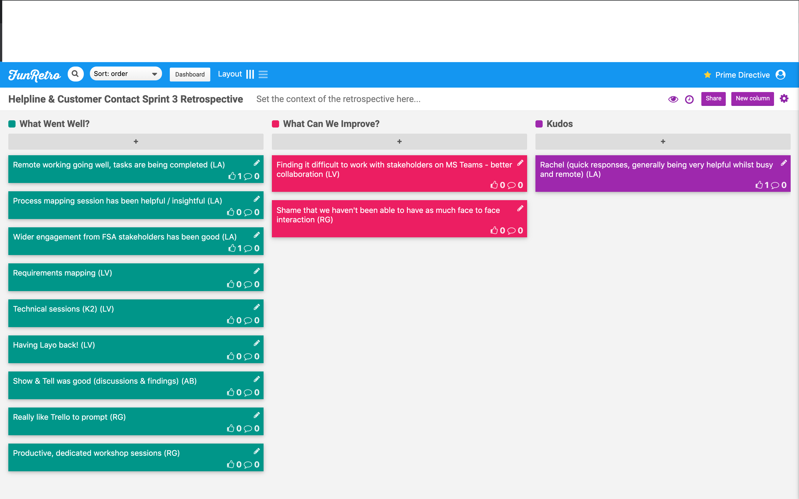
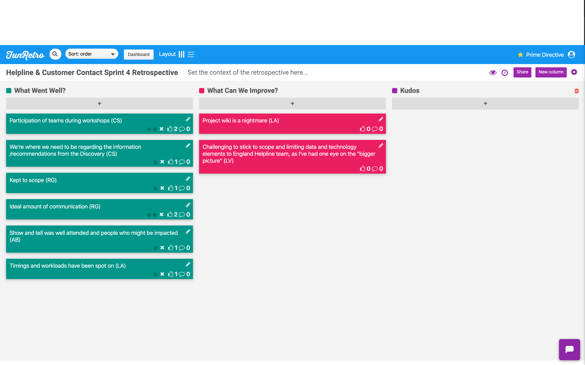

# Sprint Retrospectives

A sprint retrospective is a ceremony held by an agile team at the end of each sprint to openly discuss what is going well and what needs improvement. It's a key activity to help the team iteratively improve their working culture.

[FunRetro](https://funretro.io/) is a great tool for disbursed teams.

## Sprint 1 (02/03/20202 - 06/03/2020)
No formal sprint retrospective was help this week due to the absence of both of our Product Owners, Chris and Rachel, who were attending a pre-arranged, week long training course. Regardless, the Nb team held a team meeting and have identified the following;

### Happy
- productive workshops
- good engagement from workshop attendees
- set up this project wiki quickly
- identification of technical stakeholders to interview

### Sad
- both our PO's have been unavailable due to attending a training course
- we have not yet engaged with our DDaT representative, Andrew Bullock
- Scheduling agile ceremonies could have been completed a bit faster

## Sprint 2 (09/03/20202 - 13/03/2020)
You can view the output of our sprint retrospective below. This session covered sprints 1 and 2 given FSA members of the Discovery team have returned from training.

## Sprint 3 (16/03/20202 - 20/03/2020)
You can view the output of our sprint retrospective below.

## Sprint 4 (23/03/20202 - 27/03/2020)
You can view the output of our sprint retrospective below.

