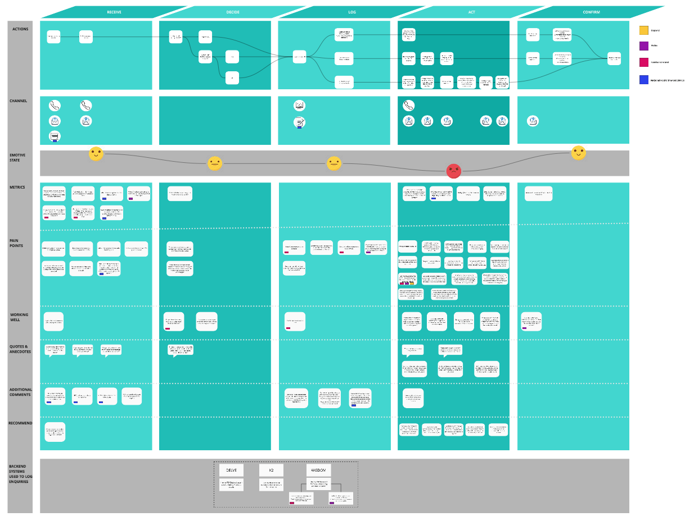

The Helpline Service Blueprint provides a single view of the service specifying the physical evidence, Helpline staff actions, support systems / infrastructure and pain points associated with the delivery of the service across its different channels and, along with other artefacts and tools, should be used to provide the benchmark for any future transformation initiatives.

Click the link to view the blueprint in detail: https://miro.com/app/board/o9J_kuvn9dc=/