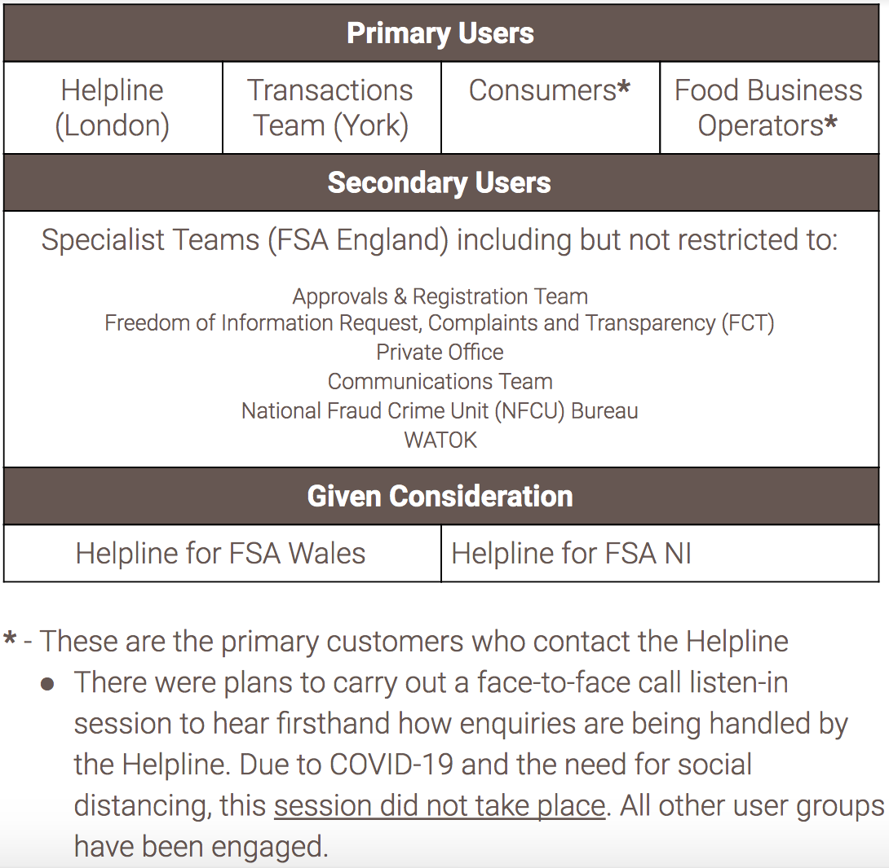

Here is an overview of the users included in workshops and interviews during this Discovery. Feedback from these users form the basis for a significant percentage of the analysis and recommendations provided. 

Notable exceptions in terms of users consulted during this Discovery are the consumers of the Helpline Service (consumers and FBO's); although the team had every intention of gathering feedback from external users it was not possible during the available time frames due to GDPR constraints (for more information on this, please speak to Rachel Growden).

