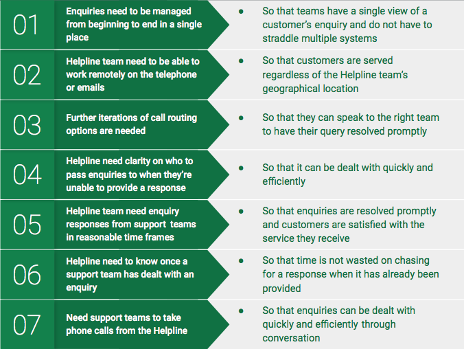

## User Needs

### Top User Needs

### Systems, Technology and Data
- Enquiries need to be managed from beginning to end in a single tool, regardless of the channel used, so that teams have a single view of a customer’s enquiry and do not have to jump between different systems or miss crucial messages
- Helpline team need to be able to work remotely with confidence on phone or emails so that customers are served regardless of the team’s geographical location
- Call routing options need to be clearer for callers so that they can route to the right team
- Data on which IVR options are being selected most frequently
- Real time data on elements such as time to pick call, abandonment rates, call duration, missed calls so that they can measure performance
- System needs to better support simultaneous call and email handling so that the team remains productive across both channels
- MI and reporting tool so that useful reports can be created quickly and easily and drive key decisions

### Ways of Working
- Helpline team need enquiry responses in a reasonable timeframe from specialist teams so that matters are resolved promptly and customers are satisfied
- When teams respond to an enquiry the helpline need to know it has been done so that time is not spent chasing
- Helpline need to know who to go to specifically with an enquiry so that it can be dealt with quickly and efficiently
- Need to be prepared with responses for incidents that generate hysteria so that time is not spent chasing teams for a response
- Need support teams to take phone calls from the Helpline so that enquiries can be dealt with quickly and efficiently through conversation
- Need to know what to do when teams are not available to take calls so that the service is maintained and customers are satisfied
- Need to know how to deal with emergency enquiries