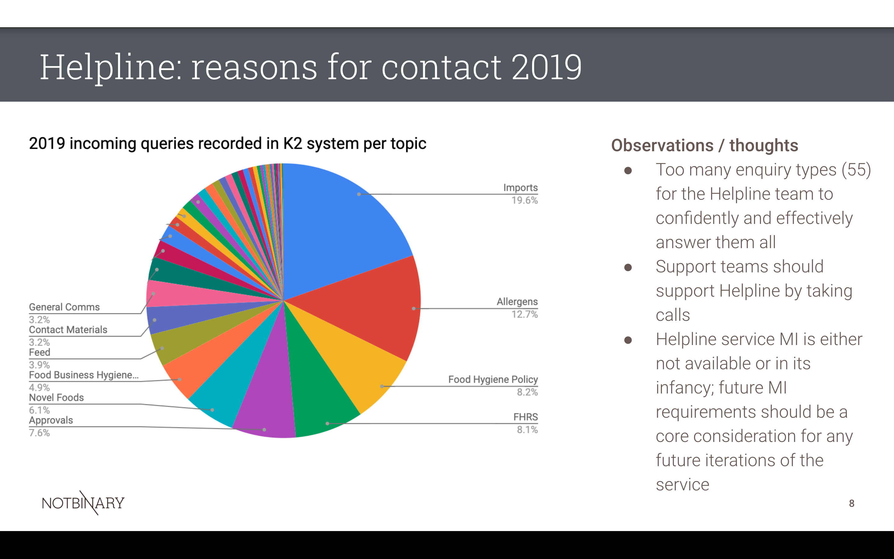
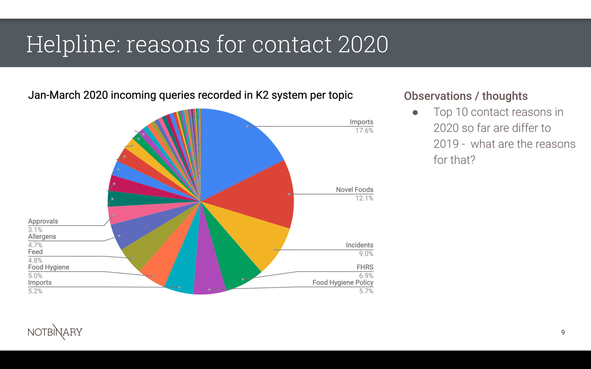
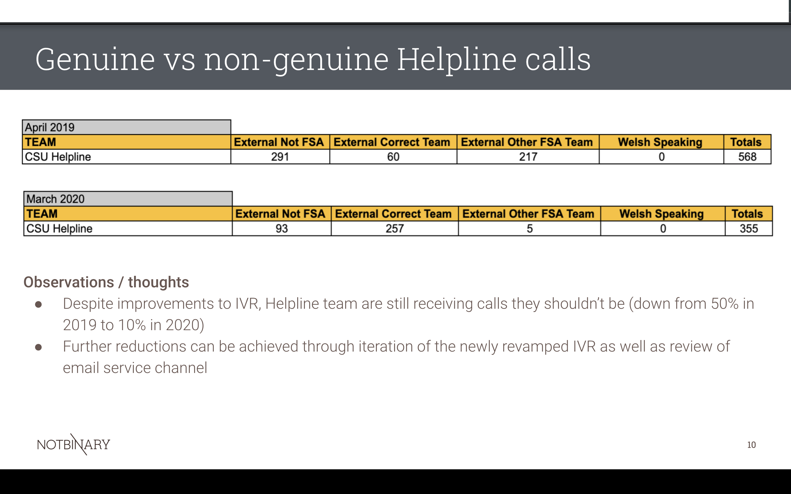

Key volumes and metrics for the Helpline service identified during the Discovery are detailed below. It should be noted that a lack of data - symptomatic of fragmented technology that does not support the delivery of the Helpline Service - means we have been unable to provide more comprehensive information in this section, with examples of missing data including core telephony & operational information, agent and team performance & customer satisfaction measures. 

**Overall enquiry volumes**
- Average enquiry volumes are approx. 10.5-12.5k per annum

**Approximate Channel split 2019**
- 52% received via telephone*
- 48% received via email*

**Approximate Channel split 2020**
- 39% received via telephone*
- 61% received via email*

In total, the Helpline team handle 55 different enquiry types, which is extremely challenging for such a small team. 

The top ten reasons for contact for 2019 can be viewed here; 

The top ten for 2020 can be viewed here; 

There is also evidence that unnecessary contacts are being received into the Helpline team. This has been addressed somewhat through the revamp of the IVR, however, it has been acknowledged that this has simply "moved the problem" with approximately 300 calls now being routed to the FSA's outsource partner. The year on year comparison, showing unnecessary contacts can be viewed here; 

**Key definitions when viewing genuine vs non-genuine demand stats**
- External Not FSA – None Genuine Demand
- External Correct team – Correct FSA Team
- External Other FSA team – Incorrect FSA Team
